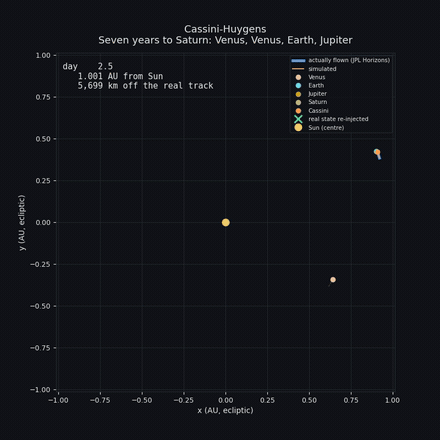

# orbital
Orbital, a N-Body Gravitation simulator

It was the Indian Space Agency’s Chandrayaan-2 mission that another time picked up my interest: If you have seen their impressive trans moon injection-manoeuvres you get the idea how impressive and interesting such mission-planning can be.

## done so far
- Implement simple Newton-laws
- N-Bodies: Rocket should rotate around Moon, Moon should rotate around Earth, Earth should rotate around Sun
- Correct Runge-Kutta 4th order, integrating all bodies simultaneously (verified 4th order convergence)
- 3D state vectors, so inclined orbits are representable — the Moon's orbit carries its real 5.145° tilt against the ecliptic
- Rust kernel via PyO3 for the RK4 step, kept bit-identical to the Python path by parity tests (measured ~7.4x speedup on 4 bodies)
- Mission- & object-data moved from source-code to external JSON config (`data/scenarios/`)
- NASA Horizons integration — real initial states, and Chandrayaan-2's actually flown trajectory as ground truth
- Burn profile derived *from* that trajectory: propagating ballistically between ephemeris samples and booking the unexplained velocity change as Δv recovers all six published ISRO manoeuvres to within minutes
- Earth's J2 oblateness, and standard gravitational parameters (GM) instead of mass × G
- Verification in layers: analytic kernel checks, mission milestones, and tracking against the real trajectory
- Adaptive step size, and Cassini's seven-year cruise to Saturn as a measure of how far a gravity-only model carries

## in progress
- Implement simple UI “Cockpit” for zoom & focus-control, visualise interesting data like individual distances, polar-coordinates
- Visualise several interesting cases, eg. Chandrayaan-2, Apollo 13, Voyager 1/2, …

## backlog/nice to have
- Artemis II still replays measured Δv; giving it the same targeting treatment should close its remaining 1.4 %
- the captured lunar orbit is 16,445 × 17,878 km against the 114 × 18,072 km actually achieved — the capture works, the descent to a low orbit is not modelled
- more perturbations: the other planets, solar radiation pressure, higher terms of Earth's gravity field. A few m/s per perigee pass are still unaccounted for.
- a 3D view — the simulation is 3D, but every view still projects onto the ecliptic
- collision response — impacts are currently detected and reported, but not physically resolved

## Artemis II


The scenario is built from the trajectory Orion *actually* flew (JPL Horizons
`-1024`). Starting from a real state just after ICPS separation, the simulation
reaches a **maximum distance from Earth of 418,745 km against the 413,146.2 km
NASA published — 1.4 % off**, on a free-return trajectory nobody targeted for
it.


Two things had to be right for that. The trans-lunar injection fires **at
perigee** rather than by the clock, and it uses the published 355 s burn
duration. Either one alone leaves the apogee 140,000 km short.

## Where the burn profile comes from

Nothing here is transcribed from a press release. Between manoeuvres a
spacecraft coasts, so propagating from one ephemeris sample to the next with
this project's own kernel and booking the leftover velocity change as Δv
recovers the burns:


Against a noise floor of 0.0001 m/s, Artemis II's TLI comes out at **388.3 m/s
where NASA published 388 m/s**, and the OTC-3 correction at **3.0 m/s against a
published 3 m/s**. Seven further spikes were discarded as bad ephemeris
samples — their contributions cancel instead of changing the orbit, which is
what tells an artefact from a burn.

## Why a measured Δv is not enough


Replaying the Δv that was measured on the flown trajectory leaves the apogee
stalled at 95,000 km (red). Letting each burn name a target apoapsis and solve
for its own Δv at ignition tracks the real climb all the way through the
trans-lunar injection (green against blue).

Two effects compound in the red curve. A burn adds energy in proportion to the
speed the craft already has, so a Δv that misses perigee is worth much less;
and a burn that falls short shortens the period, which walks the next perigee
pass out of its window.

## The integrator


Halving the step size divides the error by sixteen, against the exact solution
of Kepler's equation. That is fourth order, as RK4 requires.

Regenerate every figure with:

```bash
python make_figures.py
```

## Closing the loop

`python targeting.py chandrayaan2` searches for the trans-lunar injection
target that brings the probe closest to the Moon. It has to be searched rather
than copied: a burn of finite duration falls short of the impulsive
calculation, so the target that works (479,873 km) sits above the apogee the
mission actually reached (416,513 km).

| | before targeting | after |
|---|---|---|
| closest approach to the Moon | 189,063 km | **16,266 km** |
| Moon's Hill radius | 61,524 km | — |
| captured into lunar orbit | no | **yes**, 16,445 × 17,878 km |

That milestone is the first in this project marked `verified` rather than
`aspirational` — it is checked on every run and fails the build if missed.

One honest caveat, recorded in the scenario's limitations: with targeting the
simulation no longer replays the recorded mission, it flies its own mission to
the same target orbits. That is the normal way to do it, but it changes what
the verification says — from *can it reproduce a given trajectory* to *can it
fly a mission*.

## how well does it actually work?

`python verification.py` compares a run against the real Chandrayaan-2
trajectory from JPL Horizons. Starting from real initial states, the purely
ballistic phase tracks reality to **545 km after three days** — on a trajectory
that swings between 6,550 and 51,500 km altitude.

That number is the model's own accuracy, uncontaminated by guidance: no engine
has fired yet, so the only thing being measured is the physics.

After the burns start, the run no longer tracks the recorded trajectory point
for point — it flies its own to the same target orbits, and arrives. Telling
those two questions apart is exactly what the layered verification is for. The
older behaviour, where a replayed Δv left the apogee stalled at 61,000 km
against a real 148,000 km, is what motivated the targeting above.

## how far does the model carry, out there?

`data/scenarios/cassini_cruise.json` replays Cassini's seven-year flight to
Saturn ballistically from a real starting state, with Venus, Mars, Jupiter and
Saturn added as bodies. It answers one question: how long does a gravity-only
model track an interplanetary trajectory?

| | measured |
|---|---|
| 190 days, no manoeuvre, no flyby | **87,600 km error on a 107 million km orbit — 0.08 %** |
| the Venus flyby, ten days later | **4.06 million km — a factor of 46** |

That second row is why a flyby chain cannot be targeted with the machinery
that got Chandrayaan-2 to the Moon. A model error that looks harmless before
the encounter decides millions of kilometres after it. Cassini's trajectory is
four such encounters in series.

Adaptive step size (`physics/adaptive.py`) makes runs like this affordable:
the step follows the local orbital period, so it is seconds near a planet and
hours in cruise. On this trajectory that is 16,509 steps instead of 58,560,
agreeing to a few kilometres in 1.4 billion. On a lunar mission it saves
nothing — there the perigee passes set the pace anyway, which is the honest
result and is what the tests assert.

## running it

```bash
python -m unittest discover tests   # full test suite
python verification.py              # mission verification report
./build_rust_kernel.sh              # optional: build the Rust kernel
python main_matplotlib.py           # matplotlib visualisation
```

Simulation data lives in `data/scenarios/*.json` — all SI units, with sources
and known limitations recorded alongside the values.

## animations

Simulation (orange) against the trajectory actually flown (blue, JPL
Horizons). Every body keeps one colour throughout and is named once in the
legend; the log in the lower left records each manoeuvre as it fires, with the
Δv the targeting actually chose — so at the end you can read off which burns
produced the trajectory you just watched.

### Chandrayaan-2 — orbit raising and lunar transfer


The spiral of five perigee burns walking the apogee outwards is the whole
first half of the mission — and the probe now follows it to the Moon and is
captured into lunar orbit.

That took closed-loop targeting. Replaying a measured Δv onto an orbit that has
already drifted does something else than it did where it was measured, and the
error compounds: the first burn fell 15 % short, which shortened the period,
which walked the perigee passes forward until a later burn missed its perigee
entirely and fired 13.6 hours late. Each manoeuvre now names a **target
apoapsis** instead and solves for its own Δv at ignition, from the state it
actually finds.

### Cassini-Huygens — seven years to Saturn



A minute long — seven years compressed less brutally than the lunar missions.
Two Venus flybys, Earth, then Jupiter, then out to 9 AU. The green crosses are
where the *real* state was re-injected, and the log lists them: a flyby
amplifies the accumulated error by a factor of 46, so nothing propagates
cleanly across one. Between them the model is on its own, and the running
readout says how far off it is — around 236,000 km in the inner system, down
to 75,000 km out at 8 AU.

The two curves overlap because they agree. That is what the number is for.

### Artemis II — crewed lunar flyby


Here the two stay together: out past the Moon on a free return and back, with
the simulated maximum distance landing 1.4 % from the published figure.

Regenerate, or watch before committing to a file:

```bash
python make_animations.py --preview artemis2
```

```bash
python make_animations.py
```

Preview and export share one drawing path, so what the window shows is what
gets written. The master is an MP4 — H.264 at full quality, a few hundred KB
per second of video. The GIF is derived from it with a palette computed from
the content, which is smaller and cleaner than exporting GIF directly. Both
land in `docs/animations/`. Needs `ffmpeg` on the PATH.

Older recordings, from before any of this was verified against real
ephemerides:

[](https://www.youtube.com/watch?v=Tnh3-dnT3iw)

[](https://www.youtube.com/watch?v=6ElpsQva-jI)

## out of scope
NASA and other space-agencies have their own useful and more precise tools like GMAT. Hence, it makes no sense to replace their tools.
