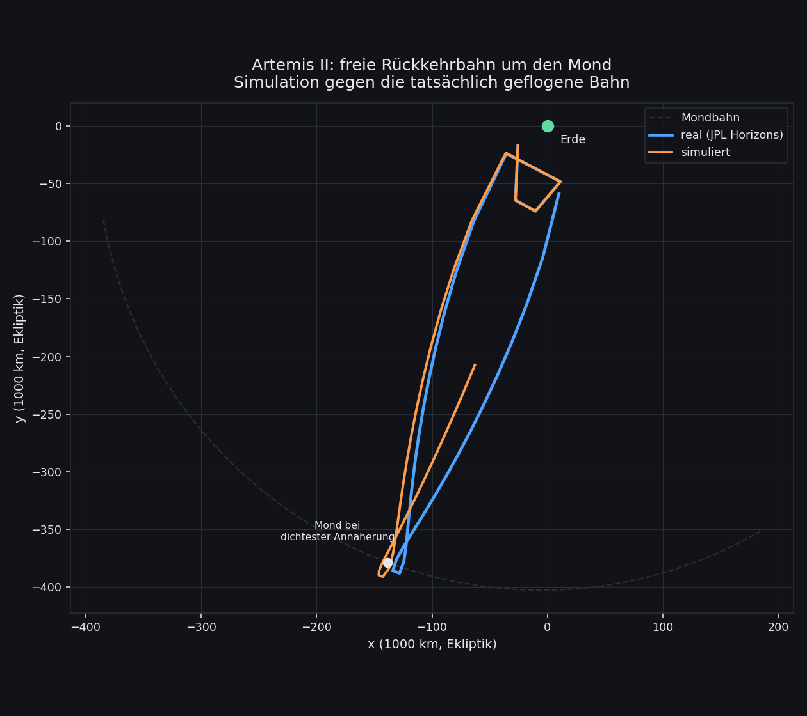
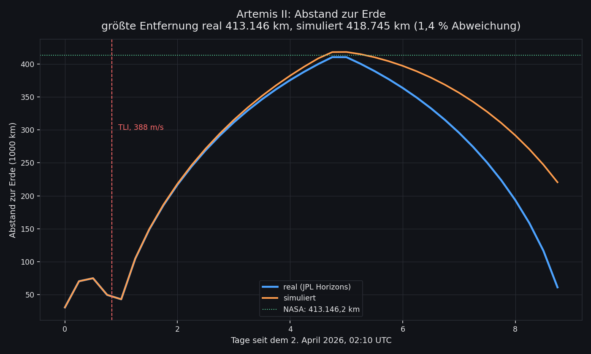
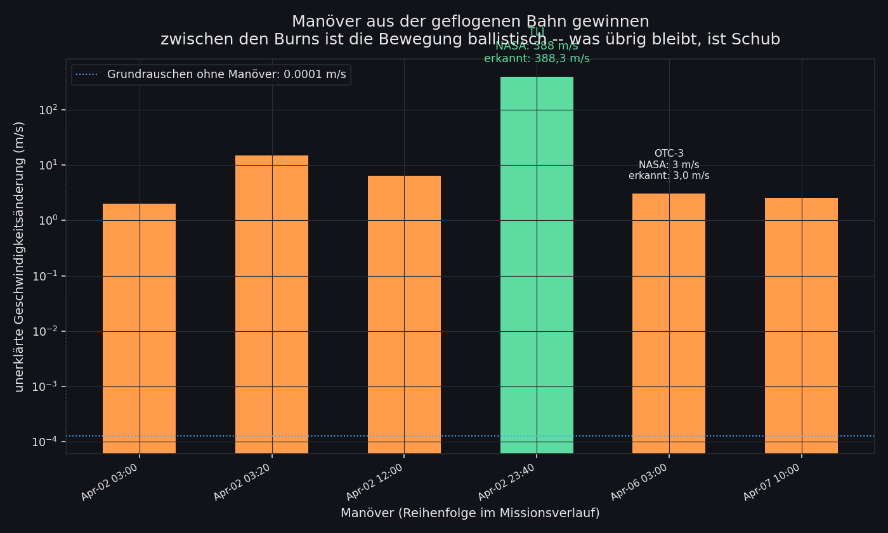
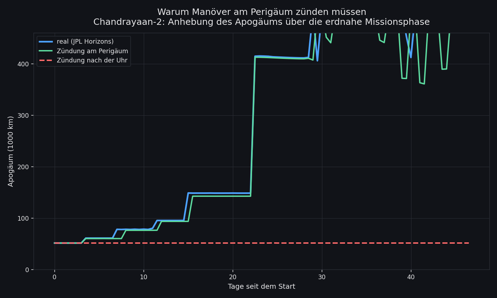
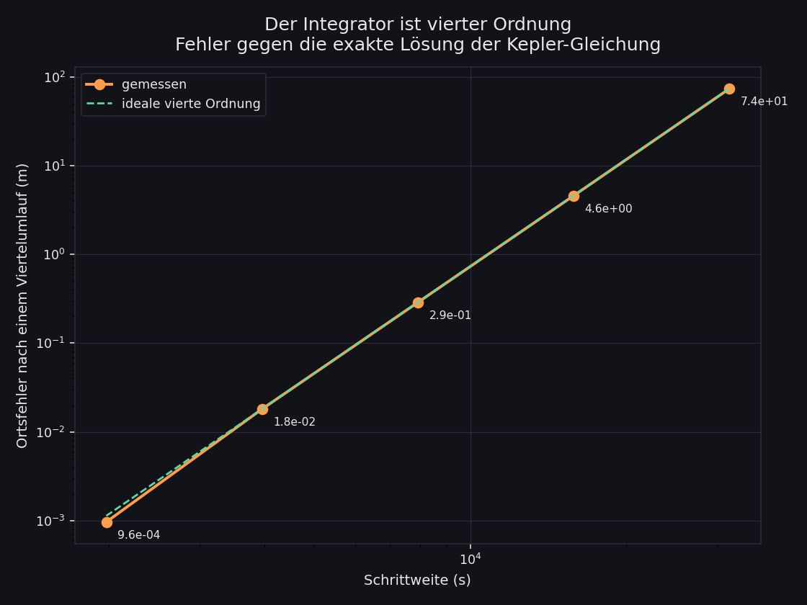
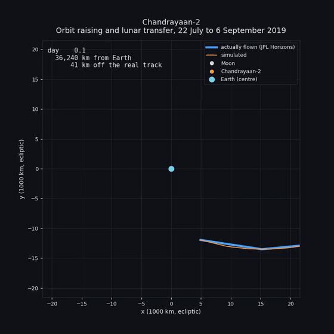
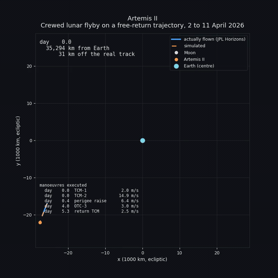

# orbital
Orbital, a N-Body Gravitation simulator

It was the Indian Space Agency’s Chandrayaan-2 mission that another time picked up my interest: If you have seen their impressive trans moon injection-manoeuvres you get the idea how impressive and interesting such mission-planning can be.

## done so far
- Implement simple Newton-laws
- N-Bodies: Rocket should rotate around Moon, Moon should rotate around Earth, Earth should rotate around Sun
- Correct Runge-Kutta 4th order, integrating all bodies simultaneously (verified 4th order convergence)
- 3D state vectors, so inclined orbits are representable — the Moon's orbit carries its real 5.145° tilt against the ecliptic
- Rust kernel via PyO3 for the RK4 step, kept bit-identical to the Python path by parity tests (measured ~7.4x speedup on 4 bodies)
- Mission- & object-data moved from source-code to external JSON config (`data/scenarios/`)
- NASA Horizons integration — real initial states, and Chandrayaan-2's actually flown trajectory as ground truth
- Burn profile derived *from* that trajectory: propagating ballistically between ephemeris samples and booking the unexplained velocity change as Δv recovers all six published ISRO manoeuvres to within minutes
- Earth's J2 oblateness, and standard gravitational parameters (GM) instead of mass × G
- Verification in layers: analytic kernel checks, mission milestones, and tracking against the real trajectory

## in progress
- Implement simple UI “Cockpit” for zoom & focus-control, visualise interesting data like individual distances, polar-coordinates
- Visualise several interesting cases, eg. Chandrayaan-2, Apollo 13, Voyager 1/2, …

## backlog/nice to have
- **targeting** — the biggest remaining gap. Burns fire at fixed absolute times, so once the trajectory drifts even slightly they hit the wrong orbital phase and the orbit raising stops working. Real missions re-target continuously. Firing burns at perigee rather than by the clock would already help a lot.
- more perturbations: the other planets, solar radiation pressure, higher terms of Earth's gravity field. A few m/s per perigee pass are still unaccounted for.
- a 3D view — the simulation is 3D, but every view still projects onto the ecliptic
- collision response — impacts are currently detected and reported, but not physically resolved

## Artemis II



The scenario is built from the trajectory Orion *actually* flew (JPL Horizons
`-1024`). Starting from a real state just after ICPS separation, the simulation
reaches a **maximum distance from Earth of 418,745 km against the 413,146.2 km
NASA published — 1.4 % off**, on a free-return trajectory nobody targeted for
it.



Two things had to be right for that. The trans-lunar injection fires **at
perigee** rather than by the clock, and it uses the published 355 s burn
duration. Either one alone leaves the apogee 140,000 km short.

## Where the burn profile comes from

Nothing here is transcribed from a press release. Between manoeuvres a
spacecraft coasts, so propagating from one ephemeris sample to the next with
this project's own kernel and booking the leftover velocity change as Δv
recovers the burns:



Against a noise floor of 0.0001 m/s, Artemis II's TLI comes out at **388.3 m/s
where NASA published 388 m/s**, and the OTC-3 correction at **3.0 m/s against a
published 3 m/s**. Seven further spikes were discarded as bad ephemeris
samples — their contributions cancel instead of changing the orbit, which is
what tells an artefact from a burn.

## Why manoeuvres fire at perigee



A burn adds energy in proportion to the speed the craft already has, so the
same Δv is worth far more at perigee. Fire by the clock and a slight drift
means missing that point entirely — Chandrayaan-2's apogee then stalls at
60,000 km (red) instead of climbing (green).

## The integrator



Halving the step size divides the error by sixteen, against the exact solution
of Kepler's equation. That is fourth order, as RK4 requires.

Regenerate every figure with:

```bash
python make_figures.py
```

## how well does it actually work?

`python verification.py` compares a run against the real Chandrayaan-2
trajectory from JPL Horizons. Starting from real initial states, the purely
ballistic phase tracks reality to **545 km after three days** — on a trajectory
that swings between 6,550 and 51,500 km altitude.

After the first burn it diverges, and honestly so: the manoeuvres replay at
fixed absolute times without any targeting, so a small phase drift means the
burn no longer happens at perigee where it would raise the apogee. The real
apogee climbs to 148,000 km; the simulated one stays near 61,000 km. That gap
is a guidance problem, not a physics one — which is exactly what the layered
verification is there to tell apart.

## running it

```bash
python -m unittest discover tests   # full test suite
python verification.py              # mission verification report
./build_rust_kernel.sh              # optional: build the Rust kernel
python main_matplotlib.py           # matplotlib visualisation
```

Simulation data lives in `data/scenarios/*.json` — all SI units, with sources
and known limitations recorded alongside the values.

## animations

Twenty seconds each, simulation (orange) against the trajectory actually flown
(blue, JPL Horizons).

### Chandrayaan-2 — orbit raising and lunar transfer



The spiral of five perigee burns walking the apogee outwards is the whole
first half of the mission. Then the real spacecraft departs for the Moon and
the simulation does not follow — the Δv values were measured on the flown
trajectory, and replaying them onto an orbit that has already drifted does
something else. That gap is the open item at the top of the backlog.

### Artemis II — crewed lunar flyby



Here the two stay together: out past the Moon on a free return and back, with
the simulated maximum distance landing 1.4 % from the published figure.

Regenerate, or watch before committing to a file:

```bash
python make_animations.py --preview artemis2
```

```bash
python make_animations.py
```

Preview and export share one drawing path, so what the window shows is what
gets written. The master is an MP4 — H.264 at full quality, a few hundred KB
per second of video. The GIF is derived from it with a palette computed from
the content, which is smaller and cleaner than exporting GIF directly. Both
land in `docs/animations/`. Needs `ffmpeg` on the PATH.

Older recordings, from before any of this was verified against real
ephemerides:

[](https://www.youtube.com/watch?v=Tnh3-dnT3iw)

[](https://www.youtube.com/watch?v=6ElpsQva-jI)

## out of scope
NASA and other space-agencies have their own useful and more precise tools like GMAT. Hence, it makes no sense to replace their tools.
